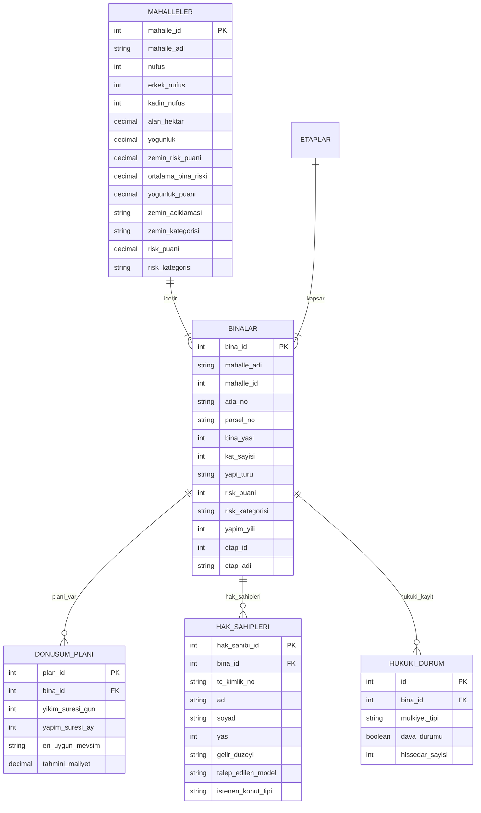

# Veritabanı İlişki Şeması

Projede kullanılan veritabanı yapısı ve tablolar arasındaki ilişkiler aşağıdadır.

```mermaid
erDiagram
    BINALAR ||--o{ DONUSUM_PLANI : "plani_var"
    BINALAR ||--o{ HAK_SAHIPLERI : "hak_sahipleri"
    BINALAR ||--o{ HUKUKI_DURUM : "hukuki_kayit"
    
    MAHALLELER ||--|{ BINALAR : "icerir"
    ETAPLAR ||--|{ BINALAR : "kapsar"

    BINALAR {
        int bina_id PK
        string mahalle_adi
        int mahalle_id
        string ada_no
        string parsel_no
        int bina_yasi
        int kat_sayisi
        string yapi_turu
        int risk_puani
        string risk_kategorisi
        int yapim_yili
        int etap_id
        string etap_adi
    }

    HAK_SAHIPLERI {
        int hak_sahibi_id PK
        int bina_id FK
        string tc_kimlik_no
        string ad
        string soyad
        int yas
        string gelir_duzeyi
        string talep_edilen_model
        string istenen_konut_tipi
    }

    DONUSUM_PLANI {
        int plan_id PK
        int bina_id FK
        int yikim_suresi_gun
        int yapim_suresi_ay
        string en_uygun_mevsim
        decimal tahmini_maliyet
    }

    HUKUKI_DURUM {
        int id PK
        int bina_id FK
        string mulkiyet_tipi
        boolean dava_durumu
        int hissedar_sayisi
    }

    MAHALLELER {
        int mahalle_id PK
        string mahalle_adi
        int nufus
        int erkek_nufus
        int kadin_nufus
        decimal alan_hektar
        decimal yogunluk
        decimal zemin_risk_puani
        decimal ortalama_bina_riski
        decimal yogunluk_puani
        string zemin_aciklamasi
        string zemin_kategorisi
        decimal risk_puani
        string risk_kategorisi
    }
```
